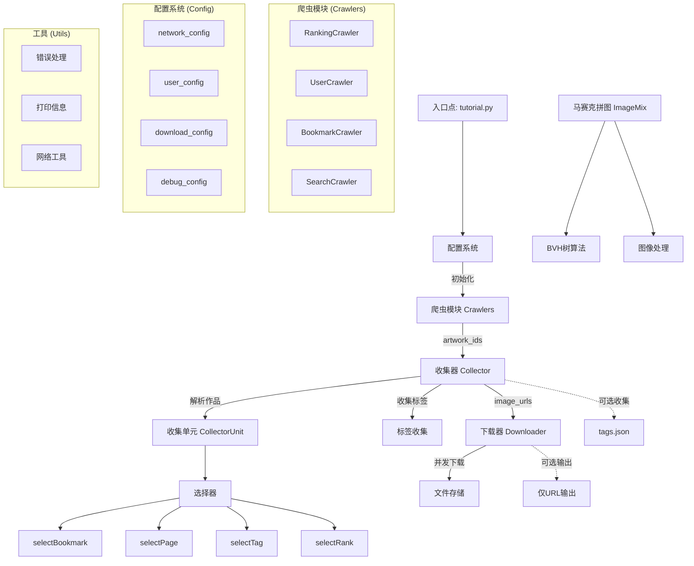

# Picals-Crawler

## 项目架构图

```mermaid
graph TD
    %% 主要入口与模块
    Start[入口点: tutorial.py] --> UserConfig[配置系统]
    UserConfig --> |初始化| C[爬虫模块 Crawlers]

    %% 爬虫模块详情
    subgraph "爬虫模块 (Crawlers)"
        C1[RankingCrawler]
        C2[UserCrawler]
        C3[BookmarkCrawler]
        C4[SearchCrawler]
    end

    %% 核心组件和数据流
    C --> |artwork_ids| Col[收集器 Collector]
    Col --> |解析作品| ColUnit[收集单元 CollectorUnit]
    Col --> |收集标签| TagCollector[标签收集]
    Col --> |image_urls| D[下载器 Downloader]
    D --> |并发下载| Storage[文件存储]

    %% 选择器系统
    ColUnit --> Selectors[选择器]
    Selectors --> S1[selectBookmark]
    Selectors --> S2[selectPage]
    Selectors --> S3[selectTag]
    Selectors --> S4[selectRank]

    %% 配置与工具
    subgraph "配置系统 (Config)"
        Config1[network_config]
        Config2[user_config]
        Config3[download_config]
        Config4[debug_config]
    end

    subgraph "工具 (Utils)"
        Utils1[错误处理]
        Utils2[打印信息]
        Utils3[网络工具]
    end

    %% 马赛克拼图功能
    ImageMix[马赛克拼图 ImageMix] --> BVHTree[BVH树算法]
    ImageMix --> ImageProcess[图像处理]

    %% 高级组件
    D -.-> |可选输出| UrlOnly[仅URL输出]
    Col -.-> |可选收集| TagsJson[tags.json]
```

## 实现模块划分

### 配置模块
